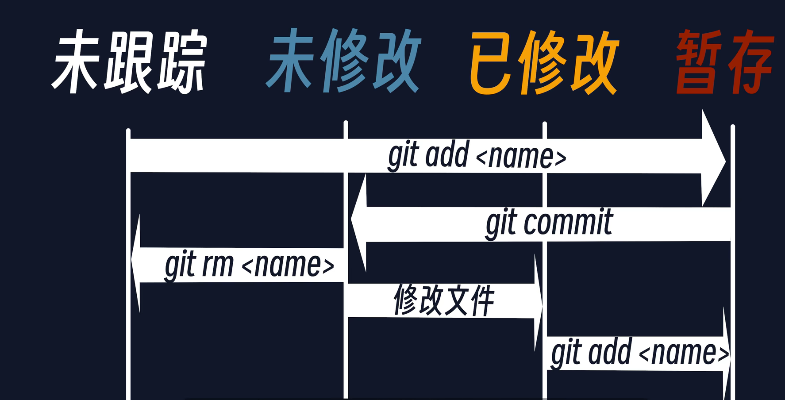
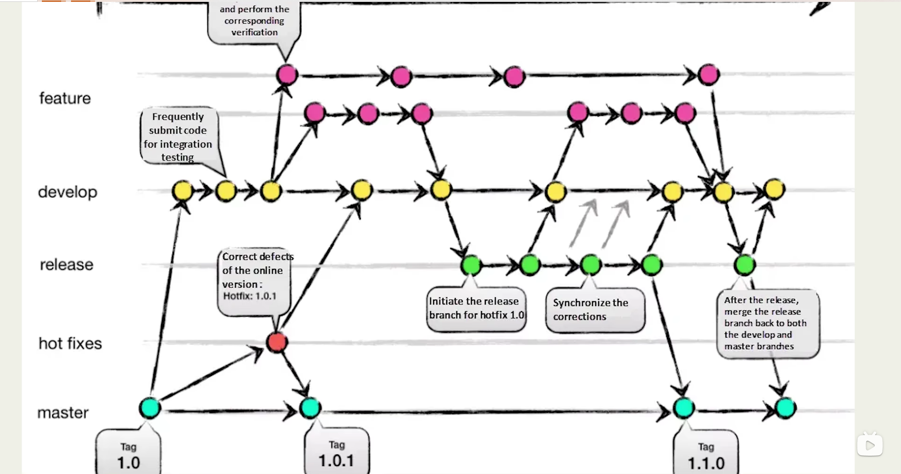

# 创建仓库
`git init`

# 文件的4个状态
* 未跟踪
``` perl
新建的文件处于未跟踪的状态，通过下面命令将其变成暂存状态
git add <name>
git commit -m "balabala"
git rm <name> 从已跟踪变成未跟踪状态

```
* 未修改
* 已修改
* 缓存



查看状态，红色是已修改但是没有暂存，绿色的是暂存的
`git status`

查看修改的内容
`git diff `

查看提交历史，支持自定义格式, 
`git log --pretty=oneline`

恢复到第一次commit之后的状态
`git reset HEAD~ --soft`

从main分支拉取最新的代码
`git pull origin main`

# 分支
每次commit都会生成一个hash值，将其视为一个提交对象，可以将分支视为指向提交对象的指针，一个提交对象可以对应多个分支

可以通过`git log`、`git status`、`git branch --list`查看分支情况

* 创建分支
  `git branch feature1`
* 创建并切换分支
  `git chckout -b feature2`





# 贮藏
代码写到一半，需要切换到别的分支，是切换不了的，因为当前工作目录是脏的，因为还没写完，一般不会commit，所以需要用到贮藏的功能  
使用`git stash`命令贮藏当前修改的内容
`git stash`等价于`git stash push`
再回到当前分支，就可以通过`git stash apply`恢复
支持多层，使用`git stash list`
使用`git stash apply stash@{1}`决定恢复哪个版本

# reset撤销提交
`git reset HEAD~ --soft`
* HEAD表示当前
* HEAD~表示上一次提交
* HEAD~2表示倒数第二次提交
* --soft表示撤销commit操作，文件会回到暂存状态
* 不加--soft的话，就直接变成修改状态，需要重新add
* --hard彻底删除，不建议使用
  
# rebase
变基操作会让提交记录变得更好看，还是要看项目组规范，不然可能会出问题

* rebase -i


# 保留一次commit 提MR

```bash
# 找到当前分支的迁出分支的commit_id
git log
# 撤销前面所有的commit，但是会保留期间所有的修改
git reset --soft commit_id
# 重新commit之后push
git push -f
```

